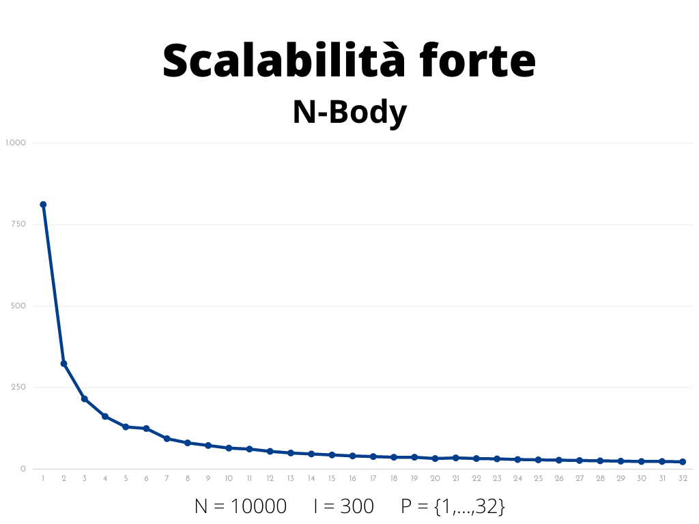
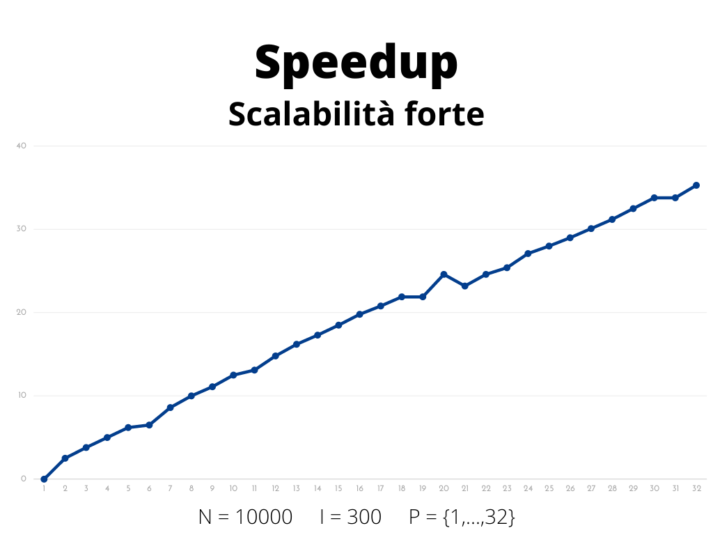

<header align = "center" style = "text-align: center">
	<span><h1>Problema N-Body con MPI</h1></span>
	Soluzione parallelizzata del problema N-Body usando MPI <br>
	<h5>
		Tiziano Citro <br>
		t.citro5@studenti.unisa.it <br>
        Repository GitHub: https://github.com/TizianoCitro/N-Body
	</h5>
</header>

## Descrizione del problema e della soluzione

### Descrizione del problema

Il problema N-Body è uno dei problemi più fertili della fisica matematica, affrontato multidisciplinarmente, per scopi diversi: 

- dai fisici interessati alla meccanica celeste e alla fisica del sistema solare 
- dagli ingegneri nel calcolo di traiettorie di velivoli spaziali
- dai matematici esperti di teoria del caos, sistemi non lineari e sistemi dinamici

L'obiettivo del problema consiste nel trovare le posizioni e le velocità di un insieme di particelle che interagiscono nel corso di un certo intervallo di tempo. Ad esempio, un astrofisico potrebbe voler conoscere le posizioni e le velocità di un gruppo di stelle oppure un chimico potrebbe voler conoscere le posizioni e le velocità di un insieme di molecole o atomi.

Una soluzione al problema N-Body è un programma che trova la soluzione simulando il comportamento delle particelle. L'input al problema è costituito dalla posizione e dalla velocità di ciascuna particella all'inizio della simulazione e l'output è in genere costituito dalla posizione e dalla velocità di ciascuna particella in una sequenza di tempi specificati dall'utente, o semplicemente dalla posizione e dalla velocità di ciascuna particella al termine di un tempo specificato dall'utente.

Risulta importante sottolineare che, indipendentemente dal numero di processori, il programma dovrà fornire lo stesso output a parità di input.

### Descrizione della soluzione

Come punto di partenza si è considerata la soluzione quadratica nel numero di particelle. Per la parte matematica del problema (calcolo della forza dei corpi), come riferimento si è presa in considerazione la seguente soluzione: <a href = "https://github.com/harrism/mini-nbody/blob/master/nbody.c">soluzione sequenziale di Harrism</a>.

Il programma proposto è in grado di simulare il processo per un determinato numero di corpi B e un determinato numero di iterazioni I. 
Il processo MASTER inizializza randomicamente un array di corpi (sulla base dell'input) e invia ad ognuno degli altri P-1 processi la porzione dell'array che è stata individuata come di sua competenza. 
Il MASTER, come ogni SLAVE, contribuisce al calcolo e quindi ogni processo simula la forza dei corpi sull'insieme delle particelle di sua compentenza. Completato il passo precedente per ognuna delle iterazioni fornite in input, ogni SLAVE invia i risultati calcolati al MASTER.
Per la fase di inizializzazione, si è utilizzato un algoritmo deterministico che permettesse la casuale inizializzazione dei corpi.

## Dettagli dell'implementazione

### Definizione della struttura per ogni particella

Ogni particella è stata rappresentata con una `struct` definita come segue:

```c
typedef struct { 
    float x, y, z, vx, vy, vz; 
} Body;
```

Nella struttura Body troviamo le componenti (x, y, z) che determinano la posizione di ogni corpo e le componenti (vx, vy, vz) che ne determinano la velocità.

### Inizializzazione

L'inizializzazione dell'array di corpi (modellati con la struttura Body) è stata realizzata usando la seguente funzione:

```c
void randomizeBodies(float *bodies, int numberOfBodies) {
    for (int body = 0; body < numberOfBodies; body++) 
        bodies[body] = 2.0f * (rand() / (float) RAND_MAX) - 1.0f;
}
```

Dove `numberOfBodies` è il numero di particelle B fornito come input al programma e `float *bodies` è definito calcolando la dimensione dell'array in byte, allocando fisicamente il buffer e facendone il cast come puntatore alla struttura definita `Body`. Di seguito lo snippet di codice che implementa quanto detto:

```c
int bytes = numberOfBodies * sizeof(Body);
float *buffer = (float*) malloc(bytes);
Body *bodies = (Body*) buffer;
```

Un passo fondamentale è la definizione di un nuovo tipo di dato derivato che permetta di sfruttare la struttura definita per modellare le particelle nelle funzioni di comuniciazione di MPI. 
Per realizzare ciò si è utilizzata `MPI_Type_create_struct()` a cui sono stati passati come parametri:

- 1: il numero di blocchi da inviare
- blocksCount: il numero di elementi in ogni blocco, definito dalla costante `BODY_FLOAT`
- offset: il displacement in byte di ogni blocco, 0 perché abbiamo solo `float`
- oldTypes: il tipo di elementi in ogni blocco
- MPI_BODY: il nuovo tipo da definire

Infine, si è utilizzata `MPI_Type_commit()` per fare la commit del nuovo tipo in modo che fosse utilizzabile nelle fasi di comunicazione. Di seguito lo snippet di codice che implementa quanto detto:

```c
MPI_Datatype MPI_BODY; 
MPI_Datatype oldTypes[1] = {MPI_FLOAT};
int blocksCount[1] = {BODY_FLOAT};
MPI_Aint offset[1] = {0};
    
MPI_Type_create_struct(1, blocksCount, offset, oldTypes, &MPI_BODY);
MPI_Type_commit(&MPI_BODY);
```

Terminato l'utilizzo del nuovo tipo di dato, si è proceduto ad invocare la `MPI_Type_free()`:

```c
MPI_Type_free(&MPI_BODY);
```

A questo punto, si è proceduto con l'individuazione dell'insieme di particelle di competenza per ciascun processo.
Si è utilizzata la funzione `buildBodiesPerProcessAndDispls()` per calcolare i due array `displs` e `bodiesPerProcess` tali che per ogni processo P, displs[P] è l'indice dell'array di corpi dove iniziano le particelle di competenza del processo P e bodiesPerProcess[P] è il numero di particelle di competenza del processo P. 
Ad esempio, se per il processo P avessimo displs[P] = 0 e bodiesPerProcess[P] = 10 allora le particelle di competenza del processo P sarebbero le particelle che occupano le posizioni {0, 1, 2, 3, 4, 5, 6, 7, 8, 9} nell'array dei corpi.

```c
void buildBodiesPerProcessAndDispls(int numberOfBodies, int numberOfTasks, int *bodiesPerProcess, int *displs) {
    int rest = numberOfBodies % numberOfTasks;
    int bodiesDifference = numberOfBodies / numberOfTasks;
    int startPosition = 0;

    for (int process = MASTER; process < numberOfTasks; process++) {
        if (rest > BODY_NO_DIFFERENCE) {
            bodiesPerProcess[process] = bodiesPerProcess[process] = bodiesDifference + 1;
            rest--;
        } else bodiesPerProcess[process] = bodiesDifference;

        displs[process] = startPosition;
        startPosition += bodiesPerProcess[process];
    }
}
```

La funzione utilizza la regola per cui il resto di una divisione è sempre minore del divisore. Per cui nel caso in cui il numero di particelle fornito in input non sia esattamente divisibile per il numero di processori, la funzione gestirà le particelle restanti assegnandone una ad ogni processo finché tali particelle non diverranno pari a 0.
Ad esempio, se avessimo un numero di particelle B = 13 e due processi (rank = 0 e rank = 1) allora la funzione assegnerebbe 7 particelle al processo con rank 0 e 6 particelle al processo con rank 1. Inoltre, si avrebbe (displs[0] = 0, bodiesPerProcess[0] = 7) e (displs[1] = 7, bodiesPerProcess[1] = 6).

### Comunicazione

Terminata la fase di inzializzazione si passa alla fase successiva che prevede la comunicazione tra i processi usando le funzioni di MPI e il calcolo delle forze usando la funzione `bodyForce()` che verrà presentata e descritta in seguito.

Il MASTER invia ad ogni SLAVE la porzione di sua compentenza usando la funzione di MPI `MPI_Scatterv()` come segue:

```c
MPI_Scatterv(
    bodies, 
    bodiesPerProcess, 
    displs, 
    MPI_BODY,
    &bodies[displs[rank]], 
    bodiesPerProcess[rank], 
    MPI_BODY, 
    MASTER,
    MPI_COMM_WORLD);
```

Alla funzione vengono passati in input:

- i corpi da inviare
- l'array bodiesPerProcess che definisce quante particelle inviare a ciascun processo
- l'array displs che definisce l'indice di partenza delle particelle di competenza di ciascun processo
- il tipo definito MPI_BODY per l'invio
- l'indirizzo in ricezione
- bodiesPerProcess[rank] che indica quanto ricevuto dal processo con rank = rank
- il tipo definito MPI_BODY per la ricezione
- il processo che sta inviando, quindi il processo MASTER
- il communicator MPI_COMM_WORLD

Dopo la `MPI_Scatterv()` ogni processo esegue un numero di iterazioni pari al numero di iterazioni I fornito in input al programma.

Ad ogni iterazione il processo calcola `bodyForce()` sulle particelle di propria competenza come segue:

```c
int independentStop = displs[rank] + bodiesPerProcess[rank];
bodyForce(bodies, DT, displs[rank], independentStop, displs[rank], independentStop);
```

Inoltre, ogni processo comunica i risultati sulle proprie particelle agli altri processi senza passare nuovamente per il MASTER utilizzando la funzione di MPI `MPI_Ibcast()`:

```c
MPI_Ibcast(&bodies[displs[process]], bodiesPerProcess[process], MPI_BODY, process, MPI_COMM_WORLD, &requests[process]);
```

Alla funzione vengono passati in input:

- l'indirizzo di invio
- l'array bodiesPerProcess[process] che definisce quante particelle il processo deve inviare
- il tipo definito MPI_BODY
- il processo che invia le particelle
- il communicator MPI_COMM_WORLD
- la richiesta da utilizare in seguito per la `MPI_Wait()`

In questo modo ogni processo potrà calcolare `bodyForce()` sulle proprie particelle in relazione con le particelle di ogni altro processo come segue:

```c
int dependentStop = displs[waitedProcess] + bodiesPerProcess[waitedProcess];
bodyForce(bodies, DT, displs[waitedProcess], dependentStop, displs[rank], independentStop);
```

Il processo `waitedProcess` è il processo di cui si sono ricevuti i risultati e per cui è possibile calcolare `bodyForce()` in relazione. Per avere maggiore controllo sull'esecuzione si è utilizzato un array di `MPI_Request` e si è atteso in ordine ogni processo a partire dal MASTER:

```c
for (int waitedProcess = MASTER; waitedProcess < numberOfTasks; waitedProcess++) {
	if (waitedProcess != rank) {
		MPI_Wait(&requests[waitedProcess], &status);

        int dependentStop = displs[waitedProcess] + bodiesPerProcess[waitedProcess];
        bodyForce(bodies, DT, displs[waitedProcess], dependentStop, displs[rank], independentStop);
	}
}
```

Prima del termine dell'iterazione viene infine eseguita la funzione `updatePositions()` che si occupa di aggiornare la posizione delle particelle in seguito a quanto calcolato. Di seguito la funzione ed il suo utilizzo:

```c
void updatePositions(Body *bodies, float dt, int start, int stop) {
    for (int body = start; body < stop; body++) { 
        bodies[body].x += bodies[body].vx * dt;
        bodies[body].y += bodies[body].vy * dt;
        bodies[body].z += bodies[body].vz * dt;
    }
}

updatePositions(bodies, DT, displs[rank], independentStop);
```

Terminate le iterazioni, il MASTER riceve tutti i risultati finali utilizzando la funzione MPI `MPI_Gatherv()` come segue:

```c
    MPI_Gatherv(
        &bodies[displs[rank]], 
        bodiesPerProcess[rank], 
        MPI_BODY, 
        bodies, 
        bodiesPerProcess, 
        displs, 
        MPI_BODY, 
        MASTER, 
        MPI_COMM_WORLD);
```

Alla funzione vengono passati in input:

- l'indirizzo in invio
- bodiesPerProcess[rank] che indica quanto inviato dal processo con rank = rank
- il tipo definito MPI_BODY per l'invio
- i corpi da ricevere
- l'array bodiesPerProcess che definisce quante particelle vengono ricevute
- l'array displs che definisce l'indice di partenza delle particelle ricevute
- il tipo definito MPI_BODY per la ricezione
- il processo che sta ricevendo, quindi il processo MASTER
- il communicator MPI_COMM_WORLD

A questo punto il MASTER si occupa semplicemente di stampare il tempo di esecuzione.

### Calcolo delle forze

La funzione usata per il calcolo delle forza è la funzione `bodyForce()` mostrata di seguito:

```c
void bodyForce(Body *bodies, float dt, int dependentStart, int dependentStop, int independentStart, int independentStop) {
    for (int i = independentStart; i < independentStop; i++) {
        float Fx = 0.0f;
        float Fy = 0.0f;
        float Fz = 0.0f;

        for (int j = dependentStart; j < dependentStop; j++) {
            float dx = bodies[j].x - bodies[i].x;
            float dy = bodies[j].y - bodies[i].y;
            float dz = bodies[j].z - bodies[i].z;
            float distSqr = dx * dx + dy * dy + dz * dz + SOFTENING;
            float invDist = 1.0f / sqrt(distSqr);
            float invDist3 = invDist * invDist * invDist;

            Fx += dx * invDist3;
            Fy += dy * invDist3;
            Fz += dz * invDist3;
        }

        bodies[i].vx += dt * Fx;
        bodies[i].vy += dt * Fy;
        bodies[i].vz += dt * Fz;
    }
}
```

La funzione prende in input:

- l'array di particelle 
- un float espresso con la costante DT nel programma e che rappresenta il time step
- due indici (`int dependentStart`, `int dependentStop`) di inizio e fine della porzione di particelle da confrontare 
- due indici (`int independentStart`, `int independentStop`) di inizio e fine della porzione di particelle locali al processo

Per ognuna delle particelle di compentenza del processo si scorrono tutte le altre usando due for annidati. Per ogni componente, si calcola la differenza delle componenti e si sommano elevando le differenze al quadrato (aggiungendo un termine di *softening* predefinito). Successivamente si calcola l'inverso della distanza e la si eleva al cubo, per poi sommare il prodotto di questo cubo e la distanza sulla componente (ad un termine `F` diverso per ogni componente) per ogni particella confrontata. Calcolata questa somma per tutte le altre particelle, la si addiziona alla componente velocità moltiplicandola prima per il time step.


## Istruzioni per l'esecuzione

Per procedere alla compilazione, utilizzare `mpicc` come segue:

<center>

```bash
mpicc nBody.c -o nBody -lm 
```
</center>

e poi eseguire il programma con `mpirun` come segue:

<center>

```bash
mpirun -np P nBody [-pY | -pN] B I
```
</center>

Dove:

- P è il numero di processori da utilizzare
- B è il numero di particelle in input
- I è il numero di iterazioni in input
- [-pY | -pN] è -pY in caso si voglia stampare l'array di particelle prima e dopo il calcolo delle forze in un file bodies.txt, -pN altrimenti

Un esempio di utilizzo è il seguente:

<center>

```bash
mpirun -np 6 nBody -pN 12 3
```
</center>

Che significa eseguire il programma su 6 processori, con un array di 12 particelle e 3 iterazioni, senza stampare l'array sul file bodies.txt.

## Correttezza

Come detto in partenza, indipendentemente dal numero di processori, il programma dovrà fornire lo stesso output a parità di input. 
Il programma risulta corretto in quanto questa condizione è rispettata ed inoltre si è confrontato il risultato dell'esecuzione della <a href = "https://github.com/harrism/mini-nbody/blob/master/nbody.c">soluzione sequenziale di Harrism</a> e il risultato del programma a parità di numero di particelle, numero di iterazioni e generazione deterministica dell'array iniziale di particelle. Il confronto tra le due esecuzioni ha portato al medesimo risultato da parte di ambedue le soluzioni. Di seguito un semplice esempio con 12 particelle e 3 iterazioni.

Con 12 particelle e 3 iterazioni, l'array dopo l'inizializzazione è:

>Body[0][-0.999343, 0.049174, 0.470847, -0.473389, -0.247552, -0.607428]<br>
Body[1][0.951748, 0.024636, 0.060898, -0.485797, -0.785825, 0.630975]<br>
Body[2][0.801089, -0.095943, -0.509223, -0.505184, -0.623452, -0.353352]<br>
Body[3][-0.793085, 0.614748, 0.068822, 0.688908, 0.474038, -0.843334]<br>
Body[4][0.078019, -0.737983, 0.725051, -0.070807, -0.056054, -0.099990]<br>
Body[5][-0.533050, -0.975365, -0.953949, 0.987019, 0.830878, 0.571675]<br>
Body[6][0.141640, 0.538481, 0.247140, -0.311552, -0.248734, -0.465776]<br>
Body[7][-0.296526, 0.281890, -0.272440, -0.894386, 0.057316, -0.684601]<br>
Body[8][-0.092363, -0.341442, -0.614439, -0.870532, 0.973052, 0.092175]<br>
Body[9][-0.821742, 0.986605, -0.132540, 0.403128, -0.626519, 0.087404]<br>
Body[10][0.990860, -0.620077, 0.368525, -0.201233, -0.122063, 0.494042]<br>
Body[11][-0.643861, 0.621563, 0.612197, -0.805078, -0.940604, -0.732060]<br>

L'output fornito con 12 particelle e 3 iterazioni è il seguente:

>Body[0][-1.010883, 0.043939, 0.451165, -0.339763, -0.137812, -0.680041]<br>
Body[1][0.934768, -0.000094, 0.078807, -0.605804, -0.843488, 0.580566]<br>
Body[2][0.784334, -0.114408, -0.517158, -0.585571, -0.611483, -0.220738]<br>
Body[3][-0.770253, 0.629754, 0.043603, 0.795809, 0.515991, -0.841131]<br>
Body[4][0.076115, -0.738071, 0.720497, -0.059691, 0.023664, -0.177790]<br>
Body[5][-0.502552, -0.948744, -0.935468, 1.031363, 0.916354, 0.638608]<br>
Body[6][0.130283, 0.529323, 0.231870, -0.412438, -0.333478, -0.530709]<br>
Body[7][-0.323403, 0.283629, -0.290870, -0.896912, 0.058419, -0.578736]<br>
Body[8][-0.118496, -0.310920, -0.609899, -0.871616, 1.039604, 0.181208]<br>
Body[9][-0.807922, 0.962507, -0.127302, 0.490559, -0.896716, 0.219994]<br>
Body[10][0.983036, -0.621838, 0.382198, -0.290754, -0.026793, 0.436357]<br>
Body[11][-0.667808, 0.591747, 0.586140, -0.794083, -1.019779, -0.937859]<br>

## Benchmark

Il programma è stato testato in termini di scalabilità forte e scalabilità debole. I test sono stati eseguiti più volte e i valori scelti sono il risulato del calcolo della media sui valori ottenuti come risultato.

Per scalabilità forte ci riferiamo a:

>Quanto velocemente deve aumentare la dimensione del problema per mantenere un'efficienza fissa quando il numero di processi aumenta. In pratica, la dimensione totale del problema rimane la medesima all'aumentare del numero di processori.

Mentre per scalabilità debole ci riferiamo a:

>Quanto velocemente l'efficienza diminuisce quando il numero di processi aumenta ma il problema è risolto. In pratica, la dimensione del problema aumenta alla stessa velocità del numero di processori, mantenendo uguale la quantità di lavoro per ogni processore.

Per la scalabilità forte è stato aumentato ad ogni test il numero di processi mantenendo costante il numero di particelle. 

Per la scalabilità debole si sono fatte due tipologie di test:

- si è mantenuto costante il lavoro per processo aumentando ad ogni test il numero di processori e il numero di particelle
- si è aumentato ad ogni test il numero di processori, il numero di particelle e il numero di iterazioni


Per testare il programma sono state utilizzate le macchine `t2.xlarge`:

Modello | vCPU | Memoria (GiB) | Storage SSD (GB) | 
--------- | ---------- | ---------- | ---------- | 
t2.xlarge | 4 | 16 | Solo EBS | 

In particolare si è utilizzato un cluster di 8 macchine `t2.xlarge`, limite massimo in quanto AWS Educate permette di avere vCPU per un totale di 32 sulla totalità delle macchine virtuali in esecuzione.


### Scalabilità forte

Per la scalabilità forte è stato aumentato ad ogni test il numero di processi mantenendo costante il numero di particelle. 
Sono state utilizzate 10000 particelle e 300 iterazioni con un numero di processi nell'insieme {1,...,32}.



### Scalabilità debole

Per la scalabilità debole si sono fatte due tipologie di test:

- si è mantenuto costante il lavoro per processo aumentando ad ogni test il numero di processori e il numero di particelle
- si è aumentato ad ogni test il numero di processori, il numero di particelle e il numero di iterazioni

#### Iterazioni non costanti

In questa tipologia di test si è aumentato ad ogni test il numero di processori, il numero di particelle e il numero di iterazioni.
Sono state utilizzate 1000 particelle e 10 iterazioni per processo con un numero di processi nell'insieme {1,...,32}.


#### Iterazioni costanti

In questa tipologia di test si è mantenuto costante il lavoro per processo aumentando ad ogni test il numero di processori e il numero di particelle.
Sono state utilizzate 1000 particelle per processo con un numero di processi nell'insieme {1,...,32} e 300 iterazioni.


### Speedup

Lo speedup è stato calcolato considerando i risultati dei test di scalabilità forte come il rapporto tra il tempo necessario ad eseguire il programma con un processore e il tempo necessario ad eseguire il programma su un numero di processori nell'insieme {2,...,32}.




